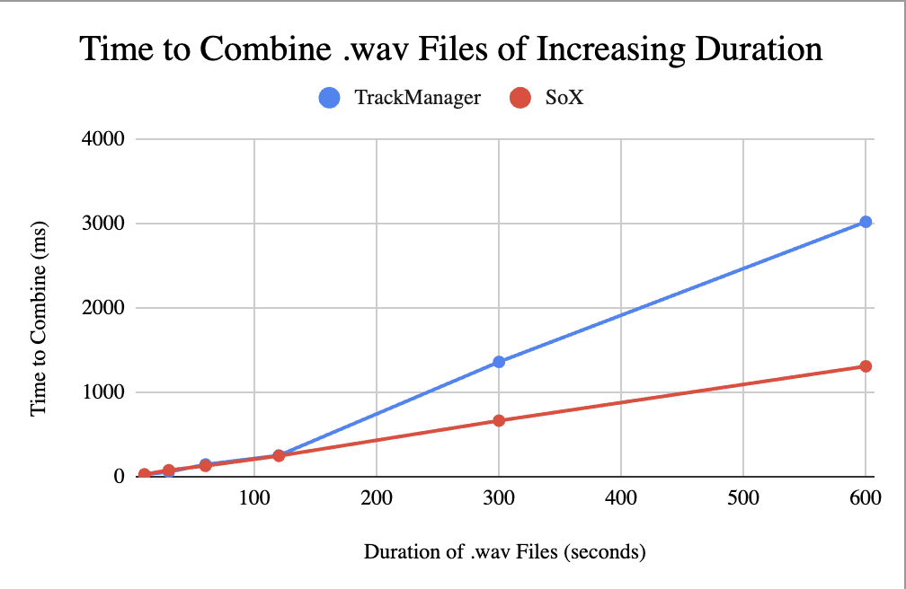
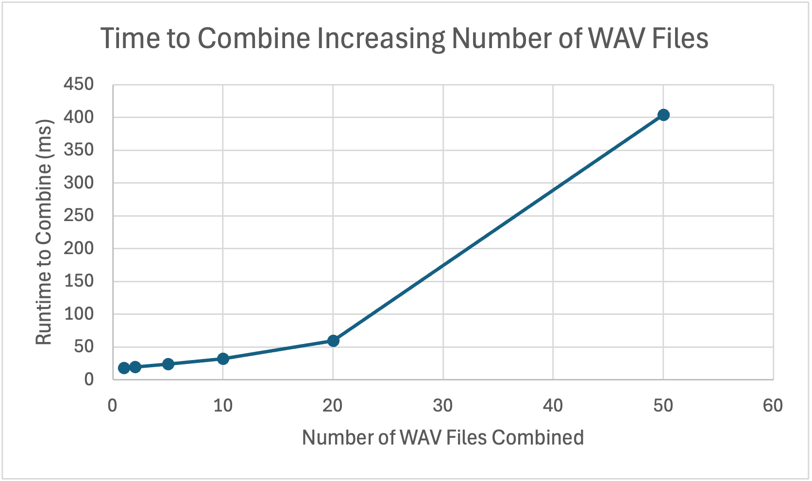

# Measurement Results

Each measurement is ran three times and averaged. `-O3` flag is used for optimization.

Note: The folder containing the .wav files used for measurement testing is too big for GitHub. The zipped version can be downloaded [here](https://drive.google.com/file/d/1EDftVz8lmKevOPQ8x0MFaowk3A-2bbnf/view?usp=sharing) (LionMail required, request access if needed). Place this folder under audio_samples.

## Time to combine three .wav files of increasing duration
| Audio Duration (seconds) | `TrackManager::combineAll`  (ms) | SoX Library (ms) |
| ------------------------ | -------------------------------- | ---------------- |
| **10**                   | 26.4191                          | 30.0046          |
| **30**                   | 58.8263                          | 79.2119          |
| **60**                   | 146.572                          | 130.122          |
| **120**                  | 253.381                          | 248.398          |
| **300**                  | 1360.65                          | 664.975          |
| **600**                  | 3018.96                          | 1308.91          |

## Time to combine increasing number of .wav files
| Num WAV Files | Time (ms) |
| ------------  | --------  |
| **2**         | 19.4643   |
| **5**         | 24.3264   |
| **10**        | 32.1325   |
| **20**        | 59.8828   |
| **50**        | 403.936   |

| Num WAV Files | `TrackManager::combineAll`  (ms) | SoX Library (ms) |
| ------------- | -------------------------------- | ---------------- |
| **2**         | 89.0743                          | 106.205          |
| **5**         | 164.279                          | 169.964          |
| **10**        | 346.398                          | 328.134          |
| **20**        | 771.555                          | 739.919          |
| **50**        | 2354.65                          | 2191.38          |

